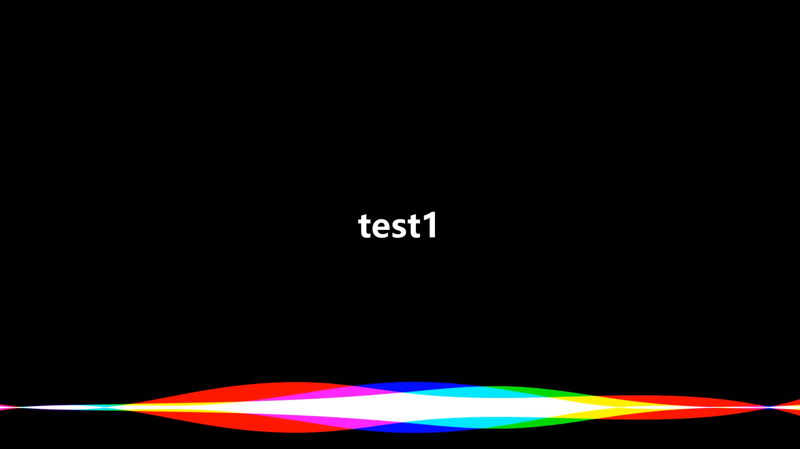

# music2vid #

原来 b 站给没版权的音乐做个动效就能投自制, 贫穷而机智如我.

- 动效尝试复现 Siri, Matplotlib 硬画
- 视频编辑 MoviePy

Music collection as self-made videos, with a Siri-like music visualizer

- Tried to reproduce Siri-like spectrum effect, with Matplotlib
- Video editing with MoviePy

# 使用/Usage #

- `pip install filetype matplotlib numpy scipy moviepy argparse`
- `python convert <dir-of-music/mv>`

# 参考/Ref list #

- [Additive blending with Matplotlib](https://stackoverflow.com/a/26712790)
- [Animation from Matplotlib to MoviePy](https://www.geeksforgeeks.org/moviepy-creating-animation-using-matplotlib/)
- [Matplotlib barcode ex](https://matplotlib.org/stable/gallery/images_contours_and_fields/barcode_demo.html#sphx-glr-gallery-images-contours-and-fields-barcode-demo-py)
- [Similiar effect with AdobeAE](https://www.avnishparker.com/AfterEffectsTemplates/SIRI-AUDIO-SPECTRUM)

